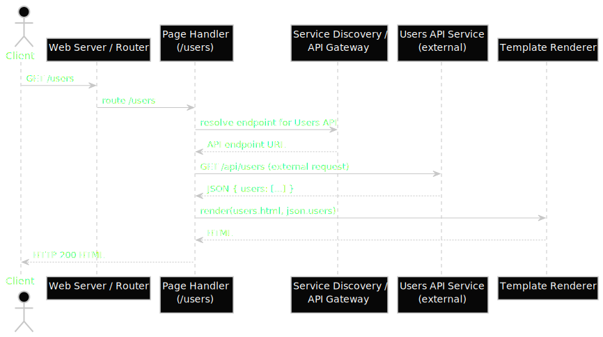

# ETL server

The ETL server is built to facilitate API development based on SQL
queries, and also allows Web development by defining a Vuego template in
the definition.

## Simple API

A simple request will run one or more queries against the database. The
data of multiple select statements can be combined into a JSON API
response.

## Web development

The data returned from the database can be used for front-end rendering.
A vuego template can take the returned data and render it to HTML.

## Web development with API

The APIs can be composed with external data sources. If your "user" database
lives on a different host and isn't accessible locally due to firewall policies,
using HTTP API calls results in:

- The webdev server/s not needing direct access to database (least privilege)
- Other JSON sources could be consumed, usage of third party APIs.

