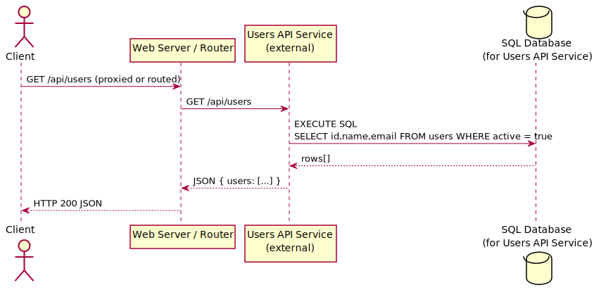
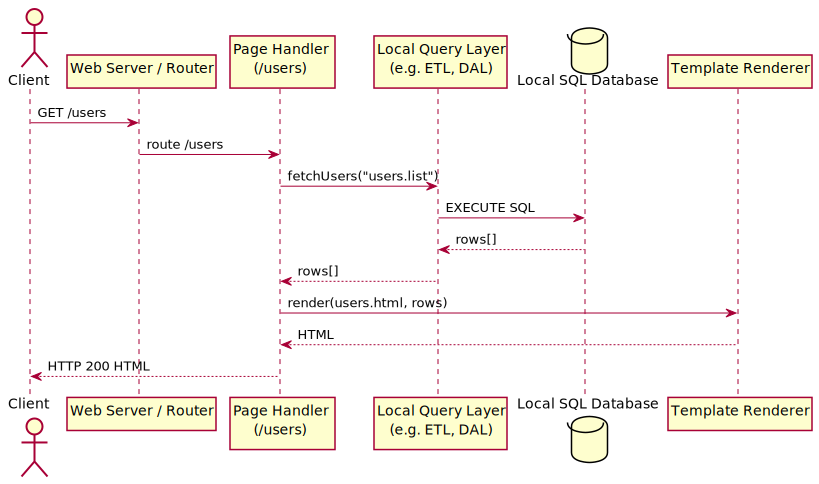

# ETL server

The ETL server is built to facilitate API development based on SQL
queries, and also allows Web development by defining a Vuego template in
the definition.

## Simple API

A simple request will run one or more queries against the database.

## Web development

The data returned from the database can be used for front-end rendering.

## Web development with external source

ETL would allow a distributed service configuration. Service discovery
could look up on which servers the API is accessible, and use a HTTP
request to fetch the JSON. This allows to consider network topology.
